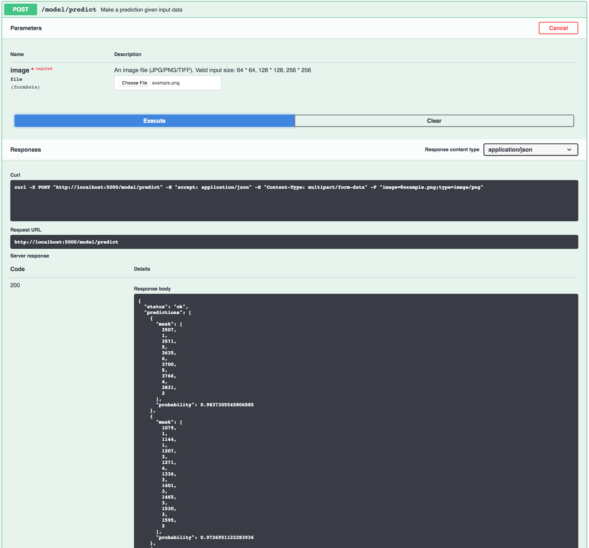

[](https://travis-ci.com/IBM/MAX-Nucleus-Segmenter)
[](http://max-nucleus-segmenter.codait-prod-41208c73af8fca213512856c7a09db52-0000.us-east.containers.appdomain.cloud)

[](http://ibm.biz/max-to-ibm-cloud-tutorial) 

# IBM Developer Model Asset Exchange: Nucleus Segmenter

The Nucleus Segmenter model detects nuclei in a microscopy image and specifies the pixels in the image that 
are assigned to each nucleus. The model is developed based on the architecture of Mask R-CNN using Feature Pyramid 
network (FPN) and a ResNet50 backbone. Given an image (of size 64 x 64, 128 x 128 or 256 x 256), this model outputs the 
segmentation masks and probabilities for each detected nucleus. The mask is compressed using 
[Run-length encoding (RLE)](https://en.wikipedia.org/wiki/Run-length_encoding).       

The model is based on the TF implementation of [Mask R-CNN](https://github.com/matterport/Mask_RCNN). 
The model is trained on the [Broad Bioimage Benchmark Collection (Accession number BBBC038, Version 1)](https://data.broadinstitute.org/bbbc/BBBC038/) 
dataset of annotated biological images. The code in this repository deploys the model as a web service in a Docker container. 
This repository was developed as part of the [IBM Developer Model Asset Exchange](https://developer.ibm.com/exchanges/models/).

## Model Metadata
| Domain | Application | Industry  | Framework | Training Data | Input Data Format |
| ------------- | --------  | -------- | --------- | --------- | -------------- |
| Vision | Medical Image Segmentation | Health care | TensorFlow | [2018 Data Science Bowl](https://data.broadinstitute.org/bbbc/BBBC038/) | Image(RGB) |

## References
* _He, K., Gkioxari, G., Dollár, P. and Girshick, R._, 2017, October. [Mask R-CNN](https://arxiv.org/abs/1703.06870). In Computer Vision (ICCV), 2017 IEEE International Conference on (pp. 2980-2988). IEEE.
* _Ljosa, V., Sokolnicki, K.L. and Carpenter, A.E._, 2012. Annotated high-throughput microscopy image sets for validation. Nature methods, 9(7), pp.637-637.
* Broad Bioimage Benchmark Collection [[Ljosa et al., Nature Methods, 2012]](https://www.nature.com/articles/nmeth.2083).
* [Mask R-CNN Github Repository](https://github.com/matterport/Mask_RCNN)

## Licenses

| Component | License | Link  |
| ------------- | --------  | -------- |
| This repository | [Apache 2.0](https://www.apache.org/licenses/LICENSE-2.0) | [LICENSE](LICENSE) |
| Model Weights | [Apache 2.0](https://www.apache.org/licenses/LICENSE-2.0) | [LICENSE](LICENSE) |
| Model Code (3rd party) | [MIT](https://opensource.org/licenses/MIT) | [LICENSE](https://github.com/matterport/Mask_RCNN/blob/master/LICENSE) |
| Test samples | Various | [Samples README](samples/README.md) |

## Training dataset
We used image set [BBBC038v1](https://data.broadinstitute.org/bbbc/BBBC038/) from 2018 Data Science Bowl®, presented by Booz Allen Hamilton and Kaggle. The dataset is available from the Broad Bioimage Benchmark 
Collection [[Ljosa et al., Nature Methods, 2012](http://dx.doi.org/10.1038/nmeth.2083)]. According to 
[this post](https://www.kaggle.com/c/data-science-bowl-2018/discussion/47864), the dataset is under Creative Commons 
license 0 (CC0 public domain). Credits for the images are available [here](https://www.kaggle.com/c/data-science-bowl-2018/discussion/54759).

## Pre-requisites:

* `docker`: The [Docker](https://www.docker.com/) command-line interface. Follow the [installation instructions](https://docs.docker.com/install/) for your system.
* The minimum recommended resources for this model is 2GB Memory and 1 CPU.

# Steps

1. [Deploy from Docker Hub](#deploy-from-docker-hub)
2. [Deploy on Kubernetes](#deploy-on-kubernetes)
3. [Run Locally](#run-locally)

## Deploy from Docker Hub

To run the docker image, which automatically starts the model serving API, run:

```
$ docker run -it -p 5000:5000 codait/max-nucleus-segmenter
```

This will pull a pre-built image from Docker Hub (or use an existing image if already cached locally) and run it.
If you'd rather checkout and build the model locally you can follow the [run locally](#run-locally) steps below.

## Deploy on Kubernetes

You can also deploy the model on Kubernetes using the latest docker image on Docker Hub.

On your Kubernetes cluster, run the following commands:

```
$ kubectl apply -f https://raw.githubusercontent.com/IBM/MAX-Nucleus-Segmenter/master/max-nucleus-segmenter.yaml
```

The model will be available internally at port `5000`, but can also be accessed externally through the `NodePort`.

## Run Locally

1. [Build the Model](#1-build-the-model)
2. [Deploy the Model](#2-deploy-the-model)
3. [Use the Model](#3-use-the-model)
4. [Run the Notebook](#4-run-the-notebook)
5. [Development](#5-development)
6. [Cleanup](#6-cleanup)


### 1. Build the Model

Clone this repository locally. In a terminal, run the following command:

```
$ git clone https://github.com/IBM/MAX-Nucleus-Segmenter
```

Change directory into the repository base folder:

```
$ cd MAX-Nucleus-Segmenter
```

To build the docker image locally, run:

```
$ docker build -t max-nucleus-segmenter .
```

All required model assets will be downloaded during the build process. _Note_ that currently this docker image is CPU only (we will add support for GPU images later).


### 2. Deploy the Model

To run the docker image, which automatically starts the model serving API, run:

```
$ docker run -it -p 5000:5000 max-nucleus-segmenter
```

### 3. Use the Model

The API server automatically generates an interactive Swagger documentation page. Go to `http://localhost:5000` to load 
it. From there you can explore the API and also create test requests. Use the `model/predict` endpoint to load a test 
image (you can use one of the test images from the `assets` folder) and get predicted probabilities and segmentation 
masks for the image from the API.



You can also test it on the command line, for example:

```
$ curl -F "image=@samples/example.png" -XPOST http://localhost:5000/model/predict
```

You should see a JSON response like that below:

```
{
  "status": "ok",
  "predictions": [
    {
      "mask": [
        3507,
        1,
        3571,
        5,
        3635,
        6,
        3700,
        5,
        3766,
        4,
        3831,
        2
      ],
      "probability": 0.9837305545806885
    },
    
    ...
    
    {
      "mask": [
        1079,
        1,
        1144,
        1,
        1207,
        3,
        1271,
        4,
        1336,
        3,
        1401,
        3,
        1465,
        3,
        1530,
        3,
        1595,
        2
      ],
      "probability": 0.9726951122283936
    },
```

### 4. Run the Notebook

Once the model server is running, you can see how to use it by walking through [the demo notebook](demo.ipynb). _Note_ the demo requires `jupyter`, `numpy`, `matplotlib`, `scikit-image`, `json`, and `requests`.

Run the following command from the model repo base folder, in a new terminal window (leaving the model server running in the other terminal window):

```
$ jupyter notebook
```

This will start the notebook server. You can open the simple demo notebook by clicking on `demo.ipynb`.

### 5. Development

To run the Flask API app in debug mode, edit `config.py` to set `DEBUG = True` under the application settings. You will then need to rebuild the docker image (see [step 1](#1-build-the-model)).

### 6. Cleanup

To stop the Docker container, type `CTRL` + `C` in your terminal.

## Resources and Contributions
   
If you are interested in contributing to the Model Asset Exchange project or have any queries, please follow the instructions [here](https://github.com/CODAIT/max-central-repo).
